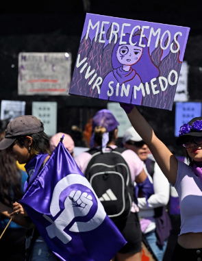
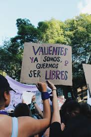
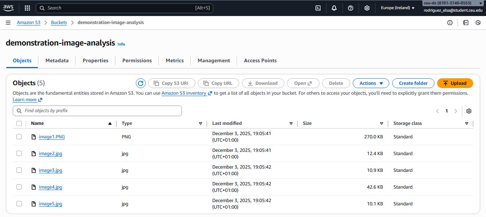
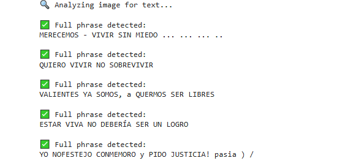
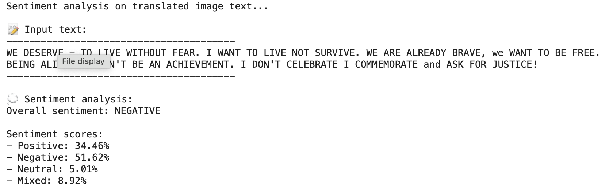
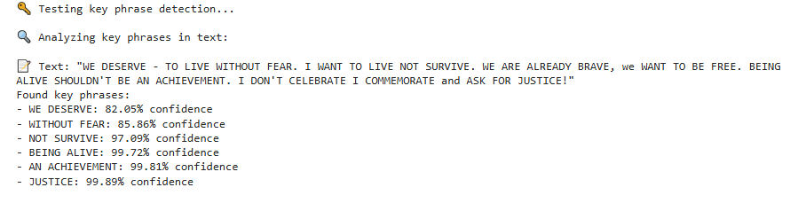

# AWS with Python for Understanding the Messages of Women’s Day Demonstrations in Latin America

Petra Ilic, 2503891

Elsa Andrea Rodriguez, 2500008

December 10th, 2025

Vienna, Austria

## Introduction
The annual protests held throughout Latin America, and particularly in Mexico, represent a culturally significant and urgently needed movement at this moment in history. Women are speaking out and expressing their dissatisfaction with the current state of gender-based violence which has reached a point where collective action is inevitable. As a result, the streets of Mexico’s major cities are increasingly taken over by demonstrations demanding change.
Although the crisis is especially severe in Mexico, sexism and violence against women are global issues. For this reason, the visibility generated by these protests should be shared with the international community. However, challenges arise when attempting to convey the tone and message that Mexican women seek to express, especially through the banners they create, which communicate the ideas and goals behind the movement.
How can newspapers and media outlets accurately share these messages and effectively translate what Latin American women want to express? The objective of this analysis is to extract, translate, and interpret the signs that fill the streets each year in order to share their messages, and the significance of this movement, with the rest of the world.

## Methodology
The central objective of this analysis is to extract, interpret, and disseminate the messages conveyed on the protest posters created by Mexican women, thereby fostering global understanding of the movement's core demands. To achieve this, the methodology begins with data collection and storage, photos documentation of the banners will be uploaded to a Amazon S3 (Simple Storage Service) bucket, establishing a centralized repository for the raw, primary data. The next step involves text recognition, where automated techniques will convert the visual information into readable and coding text. Finally, the extracted phrases will undergo translation and a subsequent analysis of tone and sentiment. This entire process, implemented using computational tools from AWS and Python programming language, is designed to accurately interpret the messages articulated by the protestors.

## Data Source
The primary data for this analysis, consisting of the photos taken on the protests, was extracted from a reputable professional journalistic source called “El Pais”. This article visually conveyed the collective determination of Mexican women to demand accountability regarding the ongoing gender violence crisis. The source material is accessible at: https://elpais.com/mexico/2023-03-08/el-8m-de-ciudad-de-mexico-en-imagenes.html#foto_gal_2. 

Figure 1. First Image to Analyze (Merecemos Vivir sin Miedo)

Figure 2. Second Image to Analyze (Quiero vivir, no sobrevivir)

Figure 3. Third Image to Analyze (Valientes ya somos, queremos ser libres)

Figure 4. Fourth Image to Analyze (Estar viva no deberia ser un logro)

Figure 5. Fifth Image to Analyze (Yo no festejo, conmemoro y pido jsuticia)

## First step: Store data in S3 Bucket
The preparatory step for utilizing the analytical tools involved ensuring data availability and accessibility. Given its robust integration with the AWS ecosystem and its wide adoption, the Simple Storage Service (S3) bucket was used fpr this project's workflow. Specifically, a dedicated S3 bucket was created, with the name “demonstration-image-analysis”, following the standard setup procedures demonstrated in the class. The images were directly uploaded to this bucket, maintaining their original PNG and JPG formats. Crucially, the public link to the S3 repository was then utilized as the direct input for the first analytical tool, establishing a continuous verifiable data pipeline for the subsequent stages of text recognition and sentiment analysis.

## Second step: Data Recognition
The AWS Rekognition service was selected for the text extraction phase due to its superior efficacy in handling creative, non standard, and artistically hand made text present on the protest banners. Amazon Rekognition excels in accurately identifying text under these challenging conditions, which often pose difficulties for standard programs. The recognition code first initiates by accessing and retrieving the image data directly from the previously provisioned S3 bucket. A modification was integrated into the standard class script to immediately generate a literal, word-for-word translation of the identified phrases. The output of this crucial step is a clean dataset of the original phrases in Spanish, exactly as displayed on the protest posters, prepared for the subsequent stages.

## Third Step: Data Translation
Following the successful and adequate identification of the banners, the data is ready for the translation phase. This crucial step utilizes a high-utility translation service, to bridge the linguistic gap and facilitate understanding for global audiences. The only modification made to the code provided in class was the accurate identification of the source language to create the expected results. The output of this phase is the English translation of the protest messages, whose accuracy and contextual relevance of these translations were rigorously validated by a project participant who is a native Spanish speaker with direct cultural context of the protests, ensuring the actual purpose of the messages shared globally.

## Fourth Step: Comprehend the Data
The final stage of this analysis involved interpreting the translated protest messages through the AWS Comprehend service. This step focuses on synthesizing the textual data into an overarching understanding of the themes and emotional tone present in the banners. Using sentiment analysis and key-phrase extraction, AWS Comprehend identifies the dominant sentiments expressed in the messages as well as the recurring concepts central to the movement. The resulting outputs provide a structured summary of the protesters’ demands and perspectives, completing the analytical pipeline from visual documentation to meaningful, globally accessible interpretation.

## Results 

## Conclusion
The comparative analysis of the results from the AWS tools against the original source imagery demonstrates the outstanding efficacy and accuracy of the implemented methodology. By implementing these tools, the project successfully achieved its objectives to extract, translate, and genuinely interpret the critical messages being articulated by Mexican women during the protests. The data produced accurately reflects the reality of the expressions found on the posters, confirming the utility of these technological solutions for contemporary social and political research. This validated data is now ready to be shared with the international community, establishing a clear communication channel where these vital issues, which transcend nationality and gender, can be openly discussed and brought to the forefront of the global conversation. Furthermore, this project is highly scalable; the established data processing pipeline can be implemented and further developed to analyze future protest data with minimal modification, ensuring its continued relevance.

## References
“El 8-M de Ciudad de México, en imágenes”. (2023, March 8). El País. Recovered from: https://elpais.com/mexico/2023-03-08/el-8m-de-ciudad-de-mexico-en-imagenes.html#foto_gal_2
